# RV32IM SoC Performance Modeling & RTL Correlation Framework

A cycle-correlated RV32IM performance engineering framework spanning functional execution, pipeline timing, cache and memory sensitivity, RTL trace comparison, pre-layout PPA analysis, synchronous SRAM integration, and physical floorplanning.

  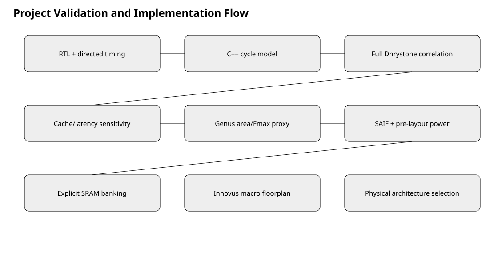

## Project highlights

- Functional RV32IM interpreter with little-endian instruction and data memories.
- Calibrated analytical model for a 5-stage IF/ID/EX/MEM/WB pipeline.
- Blocking, direct-mapped instruction and data cache models with write-back and dirty-eviction timing.
- Front-end request modeling for wrong-path fetches, redirects, cache replays, and I$/D$ stall overlap.
- Retirement-trace collection and Python comparison tooling for model-to-RTL correlation.
- Dhrystone-driven cache, memory-latency, synthesis, power, SRAM, and physical-area studies.
- Optional SystemC clocked wrapper around the C++ model.

## Headline result

The combinational-array RTL baseline was correlated exactly on the canonical Dhrystone workload:

| Metric | Correlated result |
|---|---:|
| Cycles | 1,365,926 |
| Retired instructions | 193,203 |
| Completion signature | <code>x5 = 0x003fffff</code> |
| I-cache misses | 142,419 |
| D-cache misses | 10,654 |
| D-cache writebacks | 6,056 |

The later synchronous-SRAM study compared three physical cache configurations:

| Configuration | Dhrystone cycles | SRAM macros | Core area | Cycle speedup | Equal-clock perf/area |
|---|---:|---:|---:|---:|---:|
| <code>BASE_64_64</code> | 1,549,396 | 4 | 0.4473 mm^2 | 1.000x | 1.000x |
| <code>EFF_256_64</code> | 992,158 | 6 | 0.6656 mm^2 | 1.562x | **1.049x** |
| <code>PERF_512_64</code> | **698,662** | 10 | 1.0497 mm^2 | **2.218x** | 0.945x |

<code>EFF_256_64</code> is the balanced physical recommendation. <code>PERF_512_64</code> is the cycle-performance choice when area is secondary.

  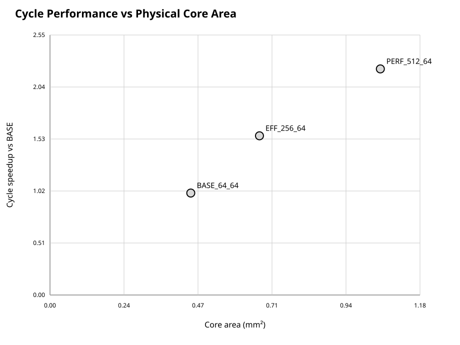

## Performance at a glance

The SRAM-backed study separates raw cycle gain from physical cost. Open any chart for the full-resolution SVG.

<table>
  <tr>
    <th>Normalized cycle speedup</th>
    <th>Normalized core area</th>
    <th>Normalized performance per area</th>
  </tr>
  <tr>
    <td><a href="docs/assets/sram_normalized_cycle_speedup.svg">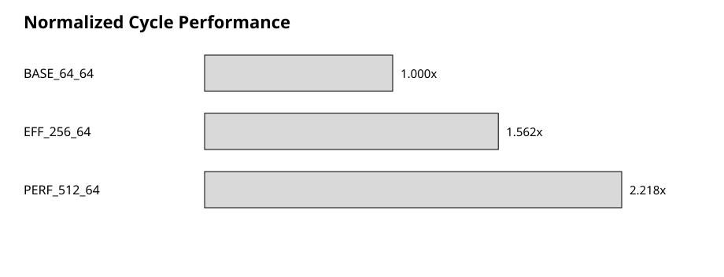</a></td>
    <td><a href="docs/assets/sram_normalized_core_area.svg">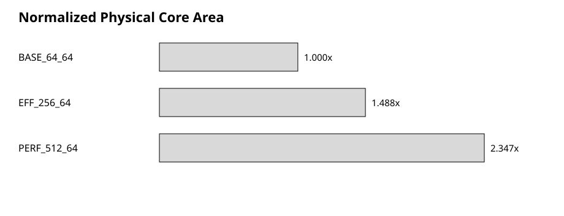</a></td>
    <td><a href="docs/assets/sram_normalized_perf_per_area.svg">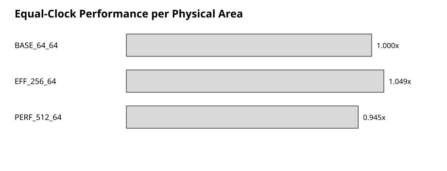</a></td>
  </tr>
</table>

## Architecture model

  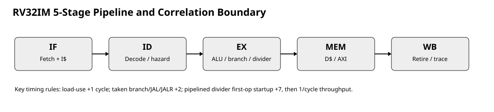

The model executes each instruction functionally, then feeds its decoded timing behavior into an independent analytical pipeline model. RTL traces are used only after prediction to measure correlation; they are not inputs to the prediction.

| Modeled effect | Calibrated behavior |
|---|---|
| Ideal pipeline | <code>N + 4</code> cycles for <code>N</code> retired instructions |
| Load-use dependency | 1-cycle interlock |
| Taken branch | 2-cycle redirect penalty |
| <code>JAL</code> / <code>JALR</code> | 2-cycle redirect penalty |
| <code>DIV</code> / <code>REM</code> burst | 7-cycle startup, then one result per cycle |
| Clean cache miss | <code>memory_latency + 4</code> held cycles |
| Dirty D-cache miss | <code>2 * memory_latency + 7</code> held cycles |

The front-end model also accounts for two younger fetches escaping before EX-stage redirects, repeated fetch requests during data-cache stalls, termination drain behavior, and measured cache-wait concurrency.

## Implementation evidence

The SRAM-backed branch uses explicit banked <code>RAM2P_128x16</code> macros. These are original Genus and Innovus captures from the implementation flow; each image links to its full-resolution asset.

### Genus mapped schematics

<table>
  <tr>
    <th>Top-level SoC connectivity</th>
    <th>RV32IM pipeline detail</th>
  </tr>
  <tr>
    <td><a href="docs/assets/genus_top_soc_schematic.gif">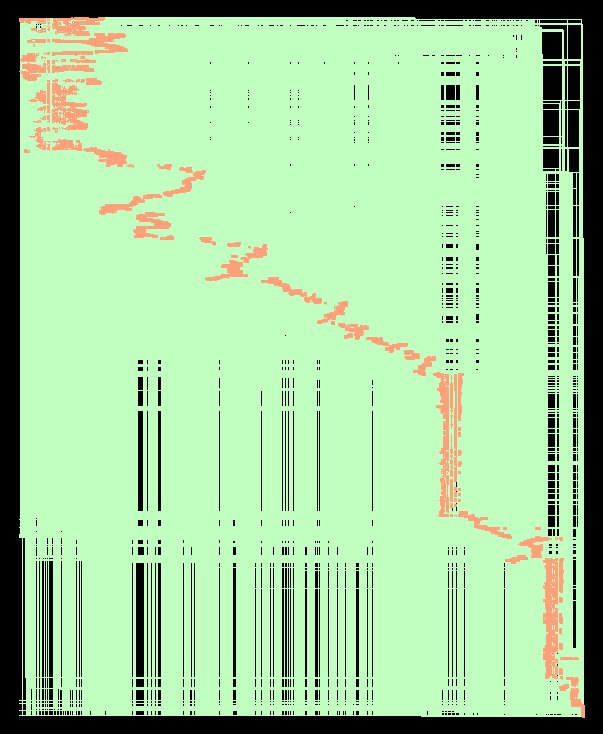</a></td>
    <td><a href="docs/assets/genus_rv32im_pipeline_detail.gif">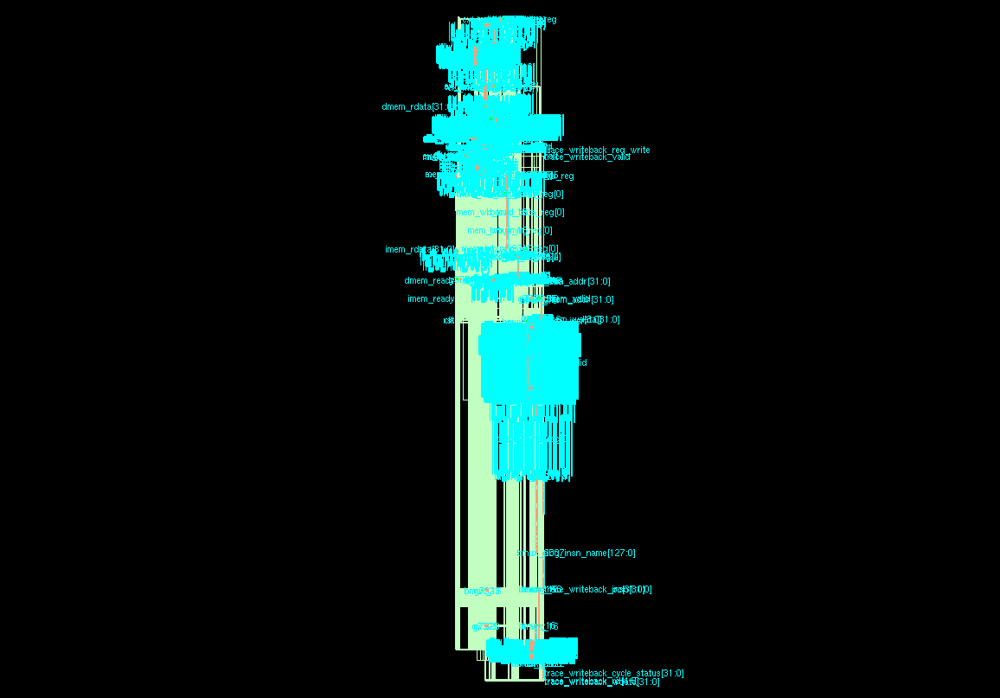</a></td>
  </tr>
  <tr>
    <th>Full pipeline mapped view</th>
    <th>32-bit SRAM banking wrapper</th>
  </tr>
  <tr>
    <td><a href="docs/assets/genus_rv32im_pipeline_full.gif">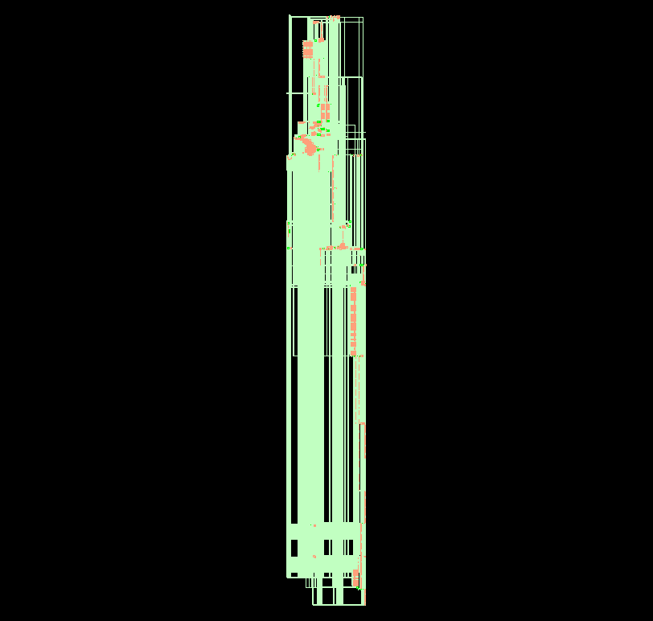</a></td>
    <td><a href="docs/assets/genus_sram32_banked_schematic.gif">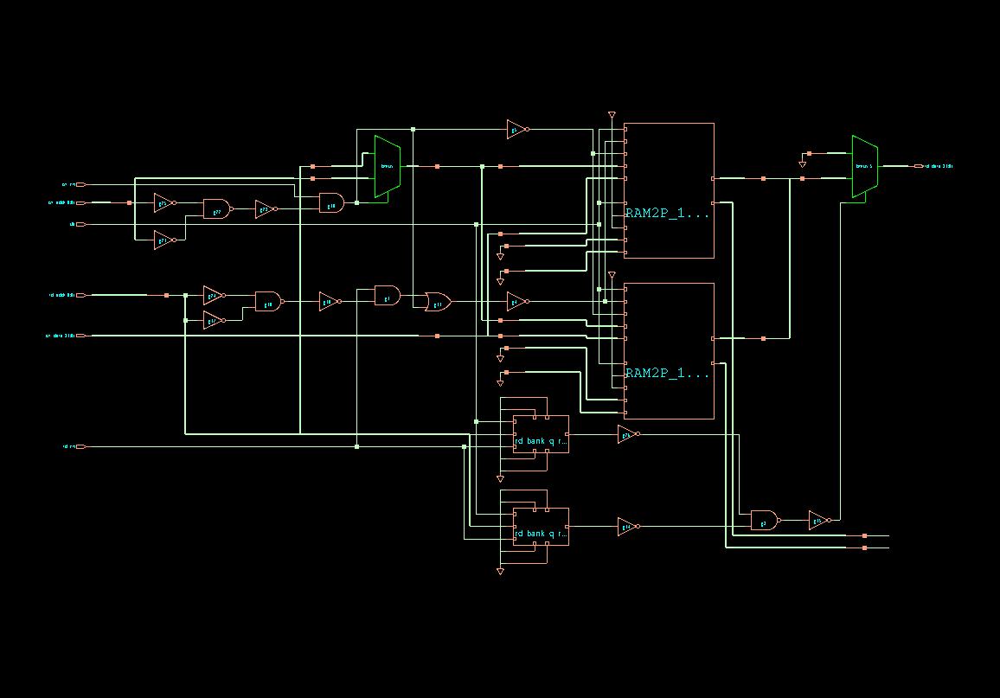</a></td>
  </tr>
</table>

The banking view makes the macro integration concrete: two 16-bit hard macros form the 32-bit memory interface, with bank control and output selection visible around the macro instances.

### CPU pipeline mapped detail

The consolidated CPU capture exposes the mapped instruction/data-memory paths, writeback controls, and retirement-trace signals in one view.

  <a href="docs/assets/cpu_pipeline_detailed.png">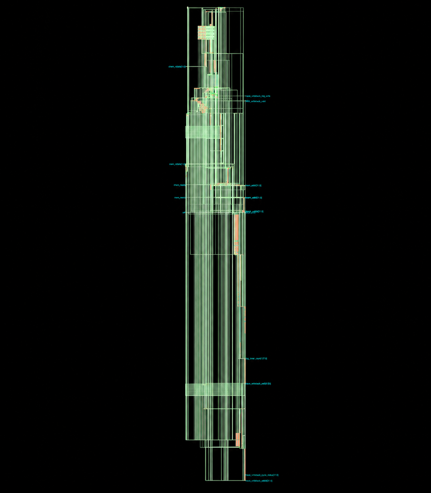</a>

A wider top-level capture provides the surrounding mapped-design context:

  <a href="docs/assets/rtl_top_mapped_schematic.png">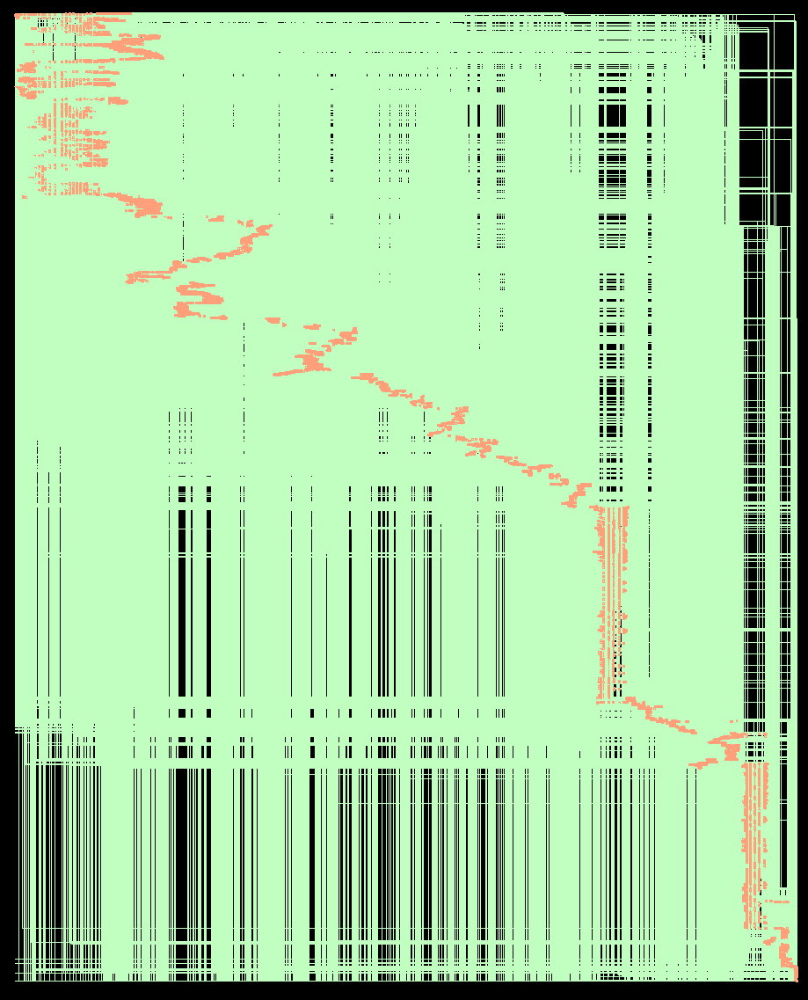</a>

### Innovus physical implementation

The three physical configurations show the cache-capacity tradeoff directly: four, six, and ten SRAM macros respectively.

<table>
  <tr>
    <th><code>BASE_64_64</code></th>
    <th><code>EFF_256_64</code></th>
    <th><code>PERF_512_64</code></th>
  </tr>
  <tr>
    <td><a href="docs/assets/innovus_BASE_64_64_floorplan.png">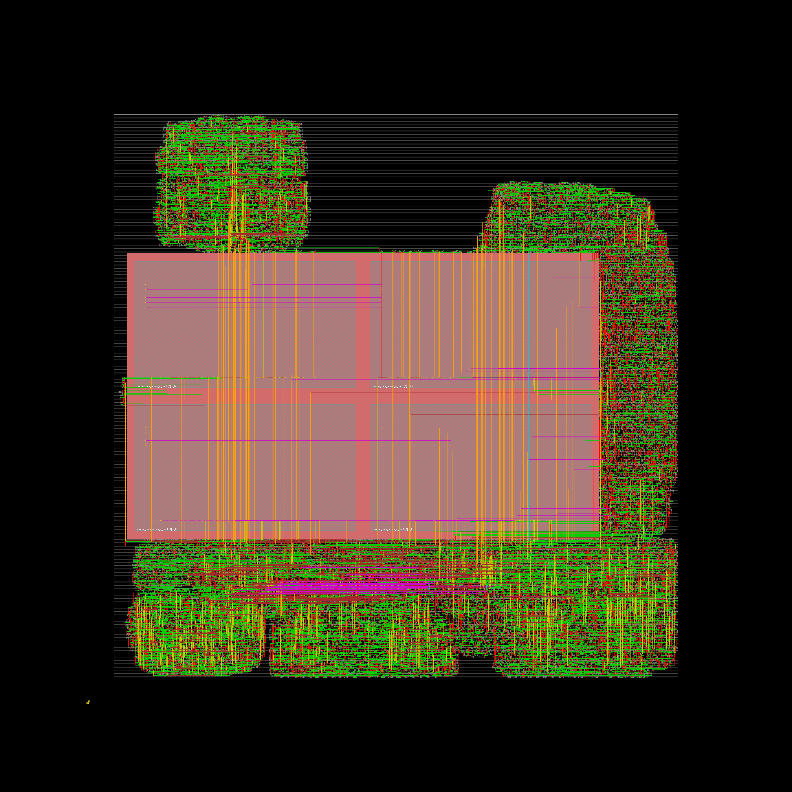</a></td>
    <td><a href="docs/assets/innovus_EFF_256_64_floorplan.png">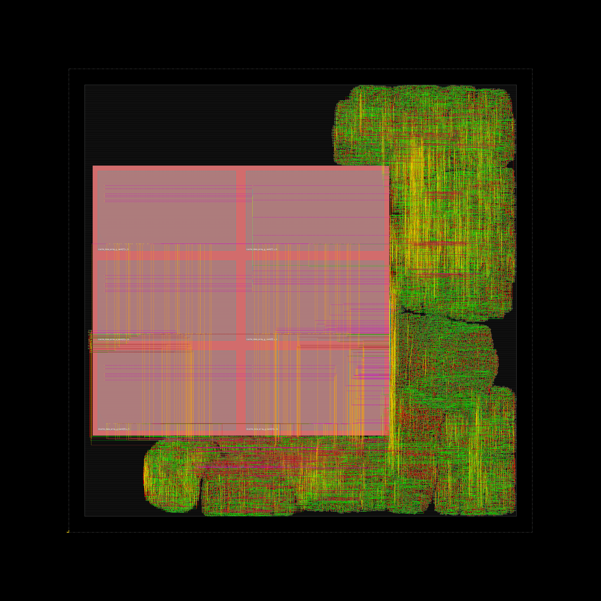</a></td>
    <td><a href="docs/assets/innovus_PERF_512_64_floorplan.png">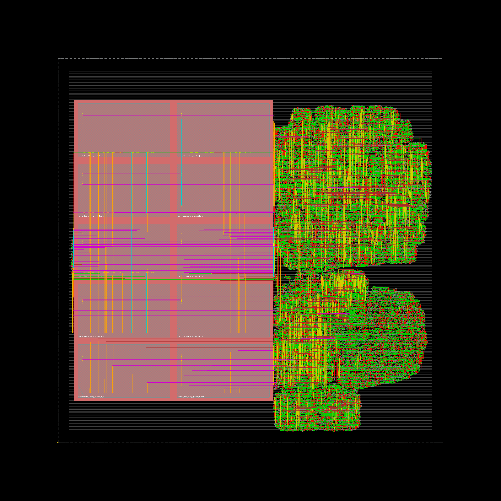</a></td>
  </tr>
  <tr>
    <td>4 SRAMs 0.4473 mm^2</td>
    <td>6 SRAMs 0.6656 mm^2 <strong>Balanced choice</strong></td>
    <td>10 SRAMs 1.0497 mm^2 <strong>Fastest in cycles</strong></td>
  </tr>
</table>

See the [curated results gallery](docs/results/README.md) for the accompanying reports, hashes, and machine-readable result tables.
## Repository layout

~~~text
include/rv32im/       Public C++ model interfaces
src/                  Functional CPU, pipeline, cache, fetch, and memory models
systemc/              Optional clocked SystemC wrapper
rtl/                  RTL retirement-trace collector
workloads/            Directed tests and Dhrystone memory images
scripts/              Validation, trace comparison, and design-space analysis
reference/            Locked validated reference data
docs/                 Architecture notes, reproduction guide, and curated evidence
results/              Full local generated evidence tree (ignored by Git)
~~~

## Quick start

Requirements:

- CMake 3.16 or newer
- A C++17 compiler
- Python 3 for analysis scripts
- SystemC only when building the optional SystemC runner

Build the standalone model:

~~~bash
cmake -S . -B build -DRV32IM_BUILD_SYSTEMC=OFF -DCMAKE_BUILD_TYPE=Release
cmake --build build --config Release
~~~

Run the smoke workload on a single-configuration generator:

~~~bash
./build/rv32im_model workloads/smoke.hex \
  --trace results/model_trace.csv \
  --dump-regs
~~~

With a multi-configuration Windows generator, use <code>build/Release/rv32im_model.exe</code>.

Run the model-only validation suite:

~~~bash
python scripts/run_validation_suite.py --model-only
~~~

More detailed workflows are in [docs/REPRODUCIBILITY.md](docs/REPRODUCIBILITY.md).

## Documentation

- [Documentation index](docs/README.md)
- [Final technical report](docs/results/FINAL_TECHNICAL_REPORT.md)
- [Verification and correlation](docs/results/VERIFICATION_AND_CORRELATION.md)
- [Canonical result table](docs/results/canonical_results.csv)
- [Claims and limitations](docs/results/CLAIMS_AND_LIMITATIONS.md)
- [Milestone history](docs/MILESTONES.md)

## Scope and limitations

This repository contains the C++/SystemC model, trace collector, workloads, analysis tooling, and curated evidence. The complete upstream CPU RTL and proprietary PDK/EDA collateral used for VCS, Genus, and Innovus runs are not redistributed here.

The hard-SRAM study intentionally does **not** claim SRAM-aware Fmax, wall-clock speedup, routed timing, or signoff PPA. The physically matched SRAM Liberty contains placeholder 999 ns clock-to-Q values, so the defensible physical comparison is equal-clock cycle performance per placed core area.